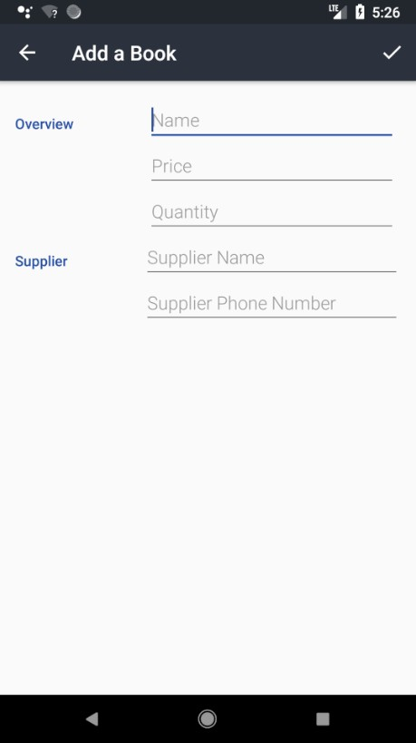

# Inventory App Stage 1

Project #8 for Android Basics by Google Nanodegree Program

<h3>Layout</h3>
<table>
  <tr>
    <th>Criteria</th>
    <th>Meets Specifications</th>
  </tr>
  <tbody>
    <tr>
      <td>
        
Overall Layout

      </td>
      <td>
        
No UI is required for this project.

        
Hint: At minimum, you will need a main activity that has methods to read data, a Contract Java class, and a DbHelper Java class.

        
Note: Even though UI is not required for this Stage, we highly recommend that you test your insert/read methods with log calls. Often, students do not realize their code has SQL syntax errors until the app is run and the methods are called which results in the project not passing.

      </td>
    </tr>
  </tbody>
</table>

<h3>Functionality</h3>
<table>
  <tr>
    <th>Criteria</th>
    <th>Meets Specifications</th>
  </tr>
  <tbody>
    <tr>
      <td>
        
Compile Time Errors

      </td>
      <td>
        
The code compiles without errors.

      </td>
    </tr>
    <tr>
      <td>
        
Table Definition

      </td>
      <td>
        
There exists a contract class that defines name of table and constants.

        
Inside the contract class, there is an inner class for each table created.

        
The contract contains at minimum constants for the Product Name, Price, Quantity, Supplier Name, and Supplier Phone Number.

      </td>
    </tr>
    <tr>
      <td>
        
Table Creation

      </td>
      <td>
        
There exists a subclass of SQLiteOpenHelper that overrides onCreate() and onUpgrade().

      </td>
    </tr>
    <tr>
      <td>
        
Data Insertion

      </td>
      <td>
        
There is a single insert method that adds:

        <ul>
          <li>Product Name</li>
          <li>Price</li>
          <li>Quantity</li>
          <li>Supplier Name</li>
          <li>Supplier Phone Number</li>
        </ul>
        
It is up to you to decide what datatype (e.g. INTEGER, STRING) each of these values should be; however, it is required that there are at least 2 different datatypes (e.g. INTEGER, STRING).

      </td>
    </tr>
    <tr>
      <td>
        
Data Reading

      </td>
      <td>
        
There is a single method that uses a Cursor from the database to perform a query on the table to retrieve at least one column of data. Also the method should close the Cursor after it's done reading from it.

      </td>
    </tr>
  </tbody>
</table>

<h3>Code Readability</h3>
<table>
  <tr>
    <th>Criteria</th>
    <th>Meets Specifications</th>
  </tr>
  <tbody>
    <tr>
      <td>
        
Readability

      </td>
      <td>
        
Code is easily readable such that a fellow programmer can understand the purpose of the app.

      </td>
    </tr>
    <tr>
      <td>
        
Naming Conventions

      </td>
      <td>
        
All variables, methods, and resource IDs are descriptively named such that another developer reading the code can easily understand their function.

      </td>
    </tr>
    <tr>
      <td>
        
Format

      </td>
      <td>
        
The code is properly formatted:

        <ul>
          <li>No unnecessary blank lines</li>
          <li>No unused variables or methods</li>
          <li>No commented out code</li>
        </ul>
        
The code also has proper indentation when defining variables and methods.

      </td>
    </tr>
  </tbody>
</table>

<em>Requirements copied from: <a href="http://udacity.com">udacity.com</a>.</em>

 

 
  

